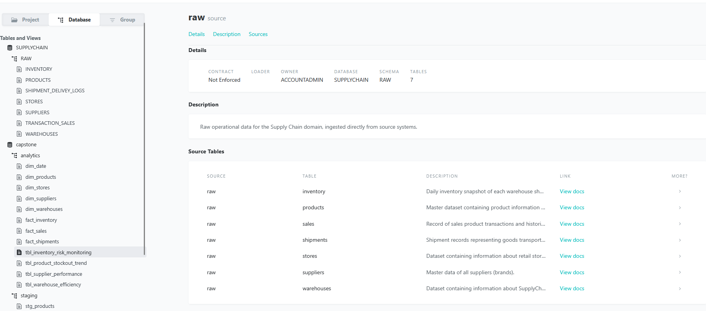

# SupplyChain360 — Data Engineering Platform

A production-grade data platform that centralizes supply chain data from multiple systems into a single, analytics-ready warehouse using an ELT architecture.

---

## Problem

SupplyChain360 operates with fragmented data across multiple systems:
- No single source of truth  
- Manual reporting  
- Poor visibility into inventory, suppliers, and sales  

This results in:
- Stockouts  
- Overstocking  
- Delayed shipments  
- Inefficient decision-making  

---

## Solution

This platform unifies all data into a structured pipeline:

**Sources → S3 (Parquet) → Snowflake → dbt models → Analytics**

Orchestrated with Airflow, provisioned with Terraform, and deployed via Docker + CI/CD.

---

## Architecture (Simplified)

Sources (S3, Google Sheets, PostgreSQL)
│
▼
Python Ingestion (Airflow DAGs)
│
▼
S3 (Parquet - Raw Layer)
│
▼
Airbyte (S3 → Snowflake)
│
▼
Snowflake (RAW → STAGING → MARTS)
│
▼
dbt (Transform + Test)

---

## Tech Stack (and WHY)

| Component | Tool | Why |
|----------|------|-----|
| Storage | S3 (Parquet) | Cheap, durable, and preserves schema vs CSV |
| Ingestion | Python (Airflow) | Full control to clean/validate messy source data |
| Data Movement | Airbyte | Handles Snowflake loading efficiently |
| Warehouse | Snowflake | Scales compute independently, strong SQL engine |
| Transformation | dbt | SQL-based, testable, version-controlled |
| Orchestration | Airflow (Docker) | Flexible scheduling + dependency management |
| Infra | Terraform | Reproducible, version-controlled infrastructure |
| CI/CD | GitHub Actions | Automates testing and Docker builds |

---

## Key Design Decisions (with WHY)

### 1. S3 as Raw Layer (Parquet)
- Acts as a durable, reusable data source  
- Enables reprocessing without re-extraction  
- Parquet ensures typed and compressed data  

---

### 2. Python Before Airbyte
- Source data is messy (JSON, inconsistent schema)  
- Python layer:
  - Cleans  
  - Flattens  
  - Validates  

Prevents bad data from reaching Snowflake  

---

### 3. Airbyte Only for S3 → Snowflake
- Avoids building custom loaders  
- Handles:
  - Incremental loads  
  - Schema detection  
  - Snowflake COPY  

---

### 4. ELT with dbt (Not ETL)
- Transform inside Snowflake for scalability  
- Provides:
  - Modular SQL models  
  - Testing  
  - Documentation  

---

### 5. Airflow in Docker (Self-hosted)
- Full control and zero infrastructure cost  
- Same environment across dev and production  

---

### 6. Terraform for Infrastructure
- Infrastructure is reproducible and version-controlled  
- Eliminates manual setup errors  

---

## Trade-offs

| Decision | Trade-off |
|--------|----------|
| S3 → Snowflake (2-step pipeline) | Adds latency but improves reliability and reprocessing |
| Python ingestion + Airbyte | More components vs simpler direct ingestion |
| Airflow self-hosted | No high availability, requires manual management |
| Airbyte Cloud | External dependency and authentication complexity |
| dbt staging as views | Query-time cost vs storage savings |

---

## Data Model

Star schema design:

- **Dimensions:** products, suppliers, stores, warehouses  
- **Facts:** sales, shipments, inventory  

Supports:
- Stockout analysis  
- Supplier performance  
- Demand trends  

---

## Orchestration Flow

1. Ingest data → S3  
2. Trigger Airbyte sync  
3. Load into Snowflake  
4. Run dbt models  
5. Run dbt tests  

---

## Data Quality

Three layers:

1. **Ingestion (Python)**  
   - Validate Parquet before upload  

2. **dbt Tests**  
   - `not_null`, `unique`, relationships  

3. **Pipeline Enforcement**  
   - Fail pipeline if tests fail  

---

## Key Learnings

- Airbyte must be manual-triggered to avoid conflicts  
- Parquet issues often come from incorrect data types  
- Separating ingestion from transformation improves reliability  
- Partitioning simplifies debugging and reprocessing  

---

## Final Outcome

A fully automated, production-style pipeline that:
- Centralizes supply chain data  
- Ensures consistent and trusted datasets  
- Supports scalable analytics  