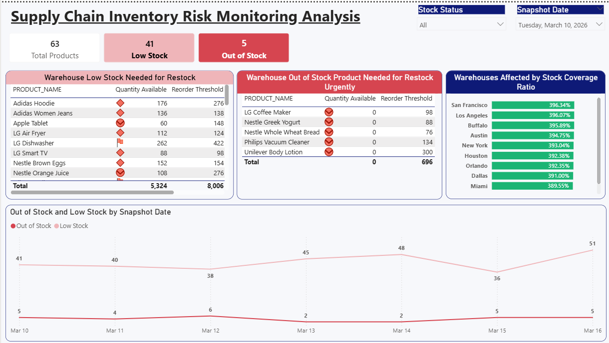

# DEC_Capstone_Project_SupplyChain_360_Engineering_Workflow
A Production based solution aimed to build a Unified Supply Chain Data Platform that centralizes operational data and enables efficient analytics for a struggling fast-growing retail distribution company.
# Project Overview
SupplyChain360 faces operational inefficiencies due to fragmented data across multiple systems. The goal is to build a production-grade data platform that centralizes all supply chain data, enabling real-time analytics for inventory planning, supplier performance, shipment tracking, and demand forecasting. This platform will reduce stockouts, optimize inventory, and improve delivery efficiency, potentially saving millions annually.

### Project key requirements:
1. Ingest data from CSV files on S3, Google Sheets, JSON on S3, and a PostgreSQL database.

2. Store my raw data as Parquet in S3 (object storage) with metadata (loaddate)

3. Using Snowflake as the data warehouse.

4. Transform the raw data using dbt into fact and dimension tables.

5. Orchestrate workflows with Apache Airflow running on Docker.

6. Containerize all code and use CI/CD for deployment.

7. Provision infrastructure with Terraform.

## Architecture Diagram

## Technology Choices

| Component               | Technology                         | Justification                                                                                   |
| ----------------------- | ---------------------------------- | ----------------------------------------------------------------------------------------------- |
| Cloud Platform          | AWS (multiple accounts)            | Existing data in S3 (Account A); we'll use separate Account B for platform resources.           |
| Object Storage          | AWS S3 (Account B)                 | Cost-effective, durable, Parquet format.                                                        |
| Data Warehouse          | Snowflake                          | Separation of compute/storage, scalable, native support for semi-structured data.               |
| Orchestration           | Apache Airflow (self-hosted on Docker) | Flexibility, full control, runs in containers.                                                  |
| Data Transformation     | dbt                                | SQL-based, version-controlled, testable.                                                        |
| Infrastructure as Code  | Terraform                          | Multi-cloud, state management, idempotent provisioning.                                         |
| Containerization        | Docker                             | Reproducibility across environments.                                                            |
| CI/CD                   | GitHub Actions                     | Integrated with GitHub, easy to set up.                                                         |
| Secret Management       | AWS SSM Parameter Store            | Already used for Postgres credentials.                                                          |

## Data Ingestion (Raw Layer)

Using Airflow dags, to extract the different data from the various source and store as Paquet file in S3 including the metadata (Ingested_at)

| Source                          | Format/Location                                      | Frequency | Ingestion Method                                                                                                                                                                                                                       | Notes                                                                                          |
| ------------------------------- | ---------------------------------------------------- | --------- | --------------------------------------------------------------------------------------------------------------------------------------------------------------------------------------------------------------------------------------- | ---------------------------------------------------------------------------------------------- |
| Product Catalog                 | CSV on S3 (DEC Account)                                | Static    | Use S3 sensor + PythonOperator with boto3 assume_role to read CSV, convert to Parquet, write to my personal AWS Account S3.                                                                                                                          | Assume IAM role in DEC AWS Account to access bucket.                                                 |
| Store Locations                 | Google Sheets                                        | Static    | PythonOperator using Google Service Account (JSON key from SSM) → Google Sheets API → pandas → Parquet → S3.                                                                                                                           |                                                                                                |
| Suppliers Data                  | CSV on S3 (DEC AWS Account)                                | Static    | Same as Product Catalog.                                                                                                                                                                                                                |                                                                                                |
| Warehouses                      | CSV on S3 (DEC AWS Account)                                | Static    | Same as Product Catalog.                                                                                                                                                                                                                |                                                                                                |
| Warehouse Inventory Snapshots   | CSV on S3 (DEC AWS Account), daily files                   | Daily     | Incremental: list objects modified since last run, copy to my S3 Account, convert to Parquet, and partition by snapshot_date.                                                                                                                  | Assume role, use S3 prefix wildcard pattern.                                                            |
| Shipment Delivery Logs          | JSON on S3 (DEC AWS Account), daily                        | Daily     | Same as inventory; flatten JSON to Parquet.                                                                                                                                                                                            |                                                                                                |
| Store Sales Transactions        | PostgreSQL (AWS, credentials in SSM)                 | Daily     | Using PostgresHook to query new table each day (sales_YYYY_MM_DD); extract, convert to Parquet, store partitioned by sale_date.                                                                                                          | To avoid full scan; will be fetching only the day's table.                                                   |
Static datasets (products, suppliers, warehouses) are ingested using idempotent overwrite pipelines. Since these datasets rarely change, snapshotting is avoided to reduce storage overhead and maintain a single source of truth

### Snapshot of Parquet Data in S3 Bucket

### 

